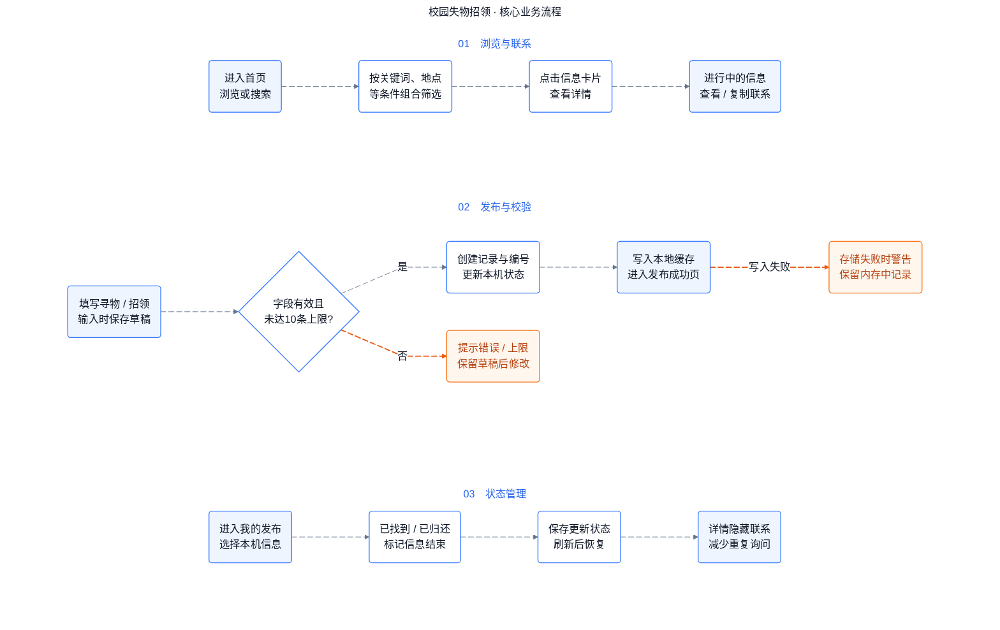

# 校园失物招领 · 核心业务流程

```mermaid
%%{init: {"theme":"base","themeVariables":{"background":"#ffffff","primaryColor":"#ffffff","primaryTextColor":"#101828","primaryBorderColor":"#3478ff","lineColor":"#64748b","clusterBkg":"#ffffff","clusterBorder":"#ffffff","edgeLabelBackground":"#ffffff","fontFamily":"Microsoft YaHei, Arial, sans-serif","fontSize":"18px"},"flowchart":{"htmlLabels":true,"curve":"linear","nodeSpacing":65,"rankSpacing":85,"padding":18}}}%%

flowchart TB

    subgraph MAIN["校园失物招领 · 核心业务流程"]
        direction TB

        subgraph S1["01　浏览与联系"]
            direction LR

            A1("进入首页<br/>浏览或搜索")
            A2("按关键词、地点<br/>等条件组合筛选")
            A3("点击信息卡片<br/>查看详情")
            A4("进行中的信息<br/>查看 / 复制联系")

            A1 e1@--> A2
            A2 e2@--> A3
            A3 e3@--> A4
        end

        subgraph S2["02　发布与校验"]
            direction LR

            B1("填写寻物 / 招领<br/>输入时保存草稿")
            B2{"字段有效且<br/>未达10条上限?"}
            B3("创建记录与编号<br/>更新本机状态")
            B4("写入本地缓存<br/>进入发布成功页")
            B5("提示错误 / 上限<br/>保留草稿后修改")
            B6("存储失败时警告<br/>保留内存中记录")

            B1 e4@--> B2
            B2 e5@-->|是| B3
            B3 e6@--> B4
            B2 e7@-->|否| B5
            B4 e8@-->|写入失败| B6
        end

        subgraph S3["03　状态管理"]
            direction LR

            C1("进入我的发布<br/>选择本机信息")
            C2("已找到 / 已归还<br/>标记信息结束")
            C3("保存更新状态<br/>刷新后恢复")
            C4("详情隐藏联系<br/>减少重复询问")

            C1 e9@--> C2
            C2 e10@--> C3
            C3 e11@--> C4
        end

        %% 不可见连接，约束上下顺序
        S1 ~~~ S2
        S2 ~~~ S3
    end

    %% 全部业务箭头开启快速动画
    e1@{ animation: fast }
    e2@{ animation: fast }
    e3@{ animation: fast }
    e4@{ animation: fast }
    e5@{ animation: fast }
    e6@{ animation: fast }
    e7@{ animation: fast }
    e8@{ animation: fast }
    e9@{ animation: fast }
    e10@{ animation: fast }
    e11@{ animation: fast }

    %% 节点样式
    classDef normal fill:#ffffff,stroke:#3478ff,stroke-width:1.5px,color:#101828
    classDef emphasis fill:#eef5ff,stroke:#3478ff,stroke-width:1.5px,color:#101828
    classDef warning fill:#fff7ed,stroke:#f97316,stroke-width:1.5px,color:#b84313

    class A1,A4,B1,B4,C1,C4 emphasis
    class A2,A3,B2,B3,C2,C3 normal
    class B5,B6 warning

    %% 模块背景与标题颜色
    style MAIN fill:#ffffff,stroke:#ffffff,stroke-width:0px,color:#101828
    style S1 fill:#ffffff,stroke:#ffffff,stroke-width:0px,color:#2563eb
    style S2 fill:#ffffff,stroke:#ffffff,stroke-width:0px,color:#2563eb
    style S3 fill:#ffffff,stroke:#ffffff,stroke-width:0px,color:#2563eb

    %% 异常分支使用橙色
    linkStyle 6,7 stroke:#ea580c,stroke-width:2px
```